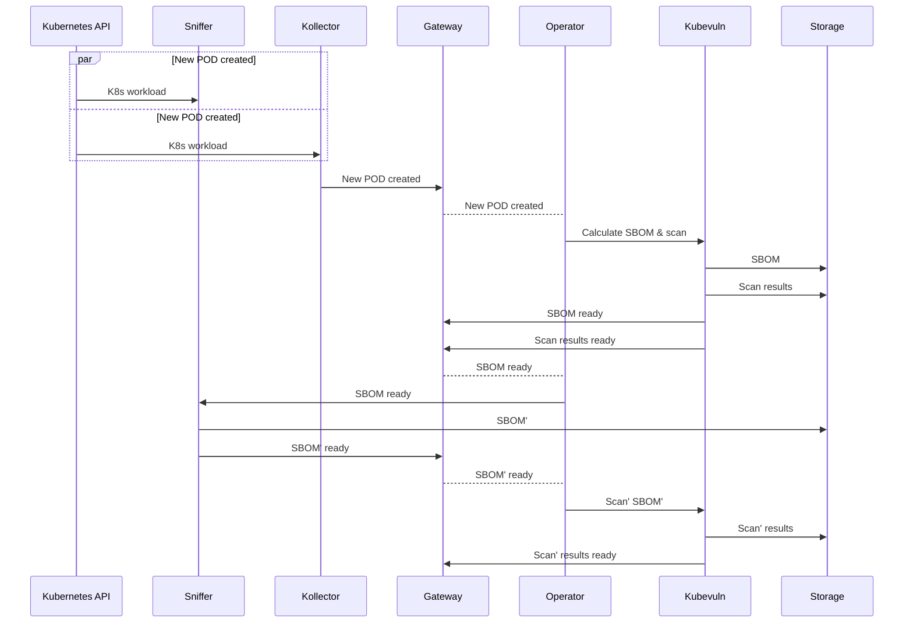

# Kubescape Operator
 

## High-level Architecture Diagram

### Flow - New Workload

```mermaid
sequenceDiagram
  
  par New POD created
    Kubernetes API->>Sniffer: K8s workload
  and New POD created
    Kubernetes API->>Kollector: K8s workload
  end
  Kollector->>Gateway: New POD created
  Gateway-->Operator: New POD created
  Operator->>Kubevuln: Calculate SBOM & scan
  Kubevuln->>Storage: SBOM
  Kubevuln->>Storage: Scan results
  Kubevuln->>Gateway: SBOM ready
  Kubevuln->>Gateway: Scan results ready
  Gateway-->Operator: SBOM ready
  Operator->>Sniffer: SBOM ready
  Sniffer->>Storage: SBOM'
  Sniffer->>Gateway: SBOM' ready
  Gateway-->Operator: SBOM' ready
  Operator->>Kubevuln: Scan' SBOM'
  Kubevuln->>Storage: Scan' results
  Kubevuln->>Gateway: Scan' results ready

```
