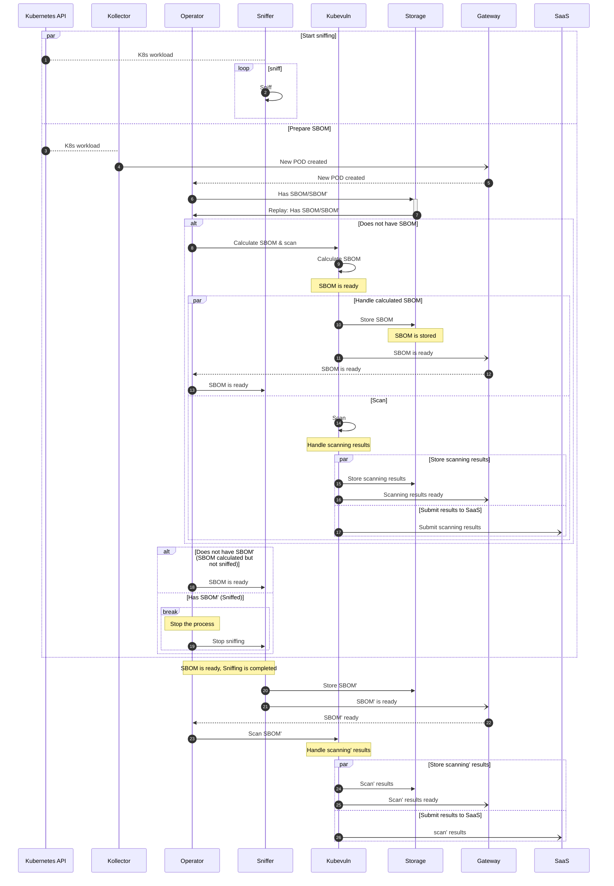

# Kubescape Operator
 

## High-level Architecture Diagram

### Flow - On startup

### Flow - New Workload

```mermaid
sequenceDiagram
  autonumber
  participant Kubernetes API
  participant Kollector
  participant Operator
  participant Sniffer
  participant Kubevuln
  participant Storage
  participant Gateway
  participant SaaS
  par Start sniffing
    Kubernetes API-->Sniffer: K8s workload
    loop sniff
      Sniffer->>Sniffer: Sniff
    end
  and Prepare SBOM
    Kubernetes API-->Kollector: K8s workload
    Kollector-)Gateway: New POD created
    Gateway-->>Operator: New POD created 
    Operator->>+Storage: Has SBOM/SBOM'
    Storage->>-Operator: Replay: Has SBOM/SBOM'
    alt Does not have SBOM
      Operator->>Kubevuln: Calculate SBOM & scan
      Kubevuln->>Kubevuln: Calculate SBOM
      Note over Kubevuln: SBOM is ready
      par Handle calculated SBOM
        Kubevuln->>Storage: Store SBOM
        Note over Storage: SBOM is stored
        Kubevuln-)Gateway: SBOM is ready
        Gateway-->>Operator: SBOM is ready
        Operator->>Sniffer: SBOM is ready
      and Scan
        Kubevuln->>Kubevuln: Scan
        Note over Kubevuln: Handle scanning results
        par Store scanning results
          Kubevuln->>Storage: Store scanning results
          Kubevuln-)Gateway: Scanning results ready
        and Submit results to SaaS
          Kubevuln-)SaaS: Submit scanning results
        end
      end
    end
    alt Does not have SBOM' (SBOM calculated but not sniffed)
      Operator->>Sniffer: SBOM is ready
    else Has SBOM' (Sniffed)
      break
        Note over Operator: Stop the process
        Operator->>Sniffer: Stop sniffing
      end
    end
  end
  Note over Operator, Sniffer: SBOM is ready, Sniffing is completed
  Sniffer->>Storage: Store SBOM'
  Sniffer-)Gateway: SBOM' is ready
  Gateway-->>Operator: SBOM' ready
  Operator->>Kubevuln: Scan SBOM'
  Note over Kubevuln: Handle scanning' results
  par Store scanning' results
    Kubevuln->>Storage: Scan' results
    Kubevuln-)Gateway: Scan' results ready
  and Submit results to SaaS
    Kubevuln-)SaaS: scan' results
  end
```
